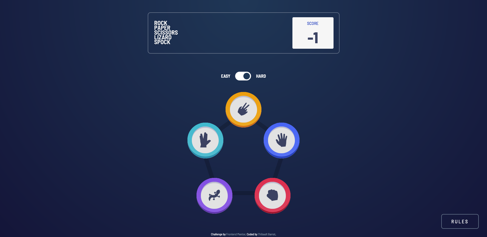

# Frontend Mentor - Rock, Paper, Scissors solution

This is a solution to the [Rock, Paper, Scissors challenge on Frontend Mentor](https://www.frontendmentor.io/challenges/rock-paper-scissors-game-pTgwgvgH). Frontend Mentor challenges help you improve your coding skills by building realistic projects.

## Table of contents

- [Frontend Mentor - Rock, Paper, Scissors solution](#frontend-mentor---rock-paper-scissors-solution)
  - [Table of contents](#table-of-contents)
  - [Overview](#overview)
    - [The challenge](#the-challenge)
    - [Screenshot](#screenshot)
    - [Links](#links)
  - [My process](#my-process)
    - [Built with](#built-with)
  - [Author](#author)

## Overview

### The challenge

Users should be able to:

- View the optimal layout for the game depending on their device's screen size
- Play Rock, Paper, Scissors against the computer
- **Bonus**: Play Rock, Paper, Scissors, Lizard, Spock against the computer _(optional)_

### Screenshot

### Links

- Solution URL: [https://www.frontendmentor.io/solutions/rock-paper-scissors-with-react-and-typescript-shbFSsmiP](https://www.frontendmentor.io/solutions/rock-paper-scissors-with-react-and-typescript-shbFSsmiP)
- Live Site URL: [https://rock-paper-scissors-brin66vn8-thibault-barrat.vercel.app/](https://rock-paper-scissors-brin66vn8-thibault-barrat.vercel.app/)

## My process

### Built with

- React.js
- SCSS module
- TypeScript

## Author

- Website - [Thibault Barrat](https://www.thibault-barrat.com/)
- Frontend Mentor - [@thibault-barrat](https://www.frontendmentor.io/profile/thibault-barrat)
- Twitter - [@Thib_Bar](https://www.twitter.com/Thib_Bar)
